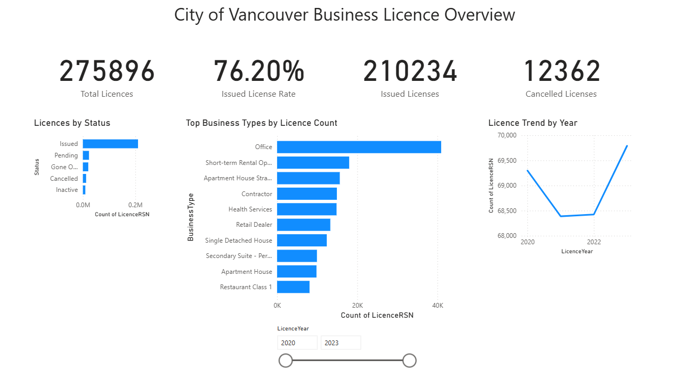
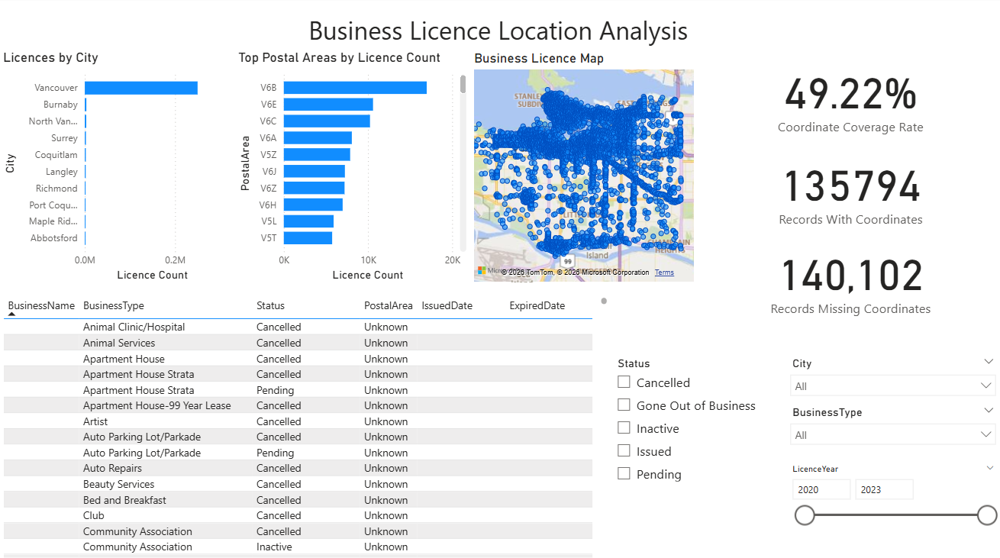
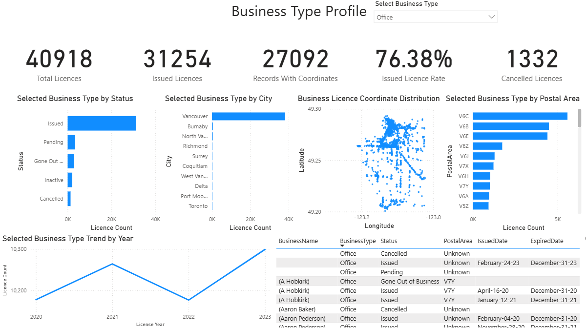
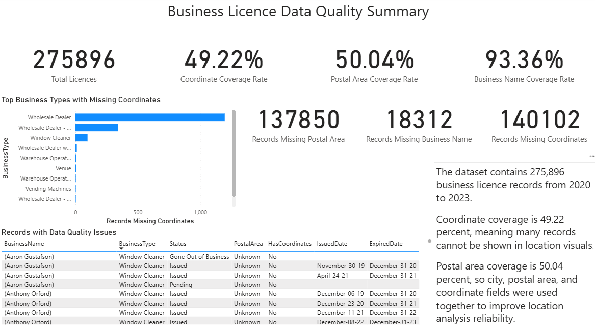

# city_of_vancouver_business_licence_dashboard
Power BI dashboard analyzing 275,896 City of Vancouver business licence records from 2020 to 2023.

# City of Vancouver Business Licence Dashboard

## Project Overview

This Power BI project analyzes City of Vancouver business licence records from 2020 to 2023. The dashboard explores licence activity by status, business type, city, postal area, location, and data quality.

The project was created to show skills in Power BI, Power Query, DAX, Excel, dashboard design, public data analysis, and data quality profiling.

## Objective

The main goal of this project is to answer the following questions:

1. How many business licence records were issued between 2020 and 2023?
2. Which business types appear most often in the dataset?
3. How are licence records distributed by status, city, and postal area?
4. How does licence activity change across the years?
5. How complete is the dataset for location analysis?
6. Which business types have the most missing coordinates or postal area values?

## Dataset

Source: City of Vancouver business licence public data

Time period analyzed: 2020 to 2023

Total records analyzed: 275,896

The dataset includes business licence information such as business name, business type, licence status, city, postal area, issued date, expired date, latitude, longitude, and coordinate availability.

## Tools Used

1. Power BI
2. Power Query
3. DAX
4. Excel
5. Data quality analysis
6. Public data profiling

## Dashboard Pages

## 1. Business Overview

This page provides a high level summary of licence activity.

Main visuals include:

1. Total licences
2. Issued licences
3. Issued licence rate
4. Cancelled licences
5. Licences by status
6. Top business types by licence count
7. Licence trend by year
8. Year, status, and business type filters

## 2. Location Analysis

This page analyzes where business licence records are concentrated.

Main visuals include:

1. Licences by city
2. Top postal areas by licence count
3. Location map or coordinate distribution
4. Coordinate coverage rate
5. Records with coordinates
6. Records missing coordinates
7. Business licence detail table

## 3. Business Type Profile

This page allows the user to select a specific business type and view its profile.

Example selected business type: Office

Main visuals include:

1. Total licences for the selected business type
2. Issued licences
3. Issued licence rate
4. Cancelled licences
5. Records with coordinates
6. Status breakdown
7. City breakdown
8. Postal area breakdown
9. Licence trend by year
10. Coordinate distribution
11. Business licence detail table

For the Office business type, the dashboard shows 40,918 total records and an issued licence rate of 76.38 percent.

## 4. Data Quality Summary

This page reviews the completeness and reliability of the dataset.

Main measures include:

1. Total licences
2. Coordinate coverage rate
3. Postal area coverage rate
4. Business name coverage rate
5. Records missing coordinates
6. Records missing postal area
7. Records missing business name

Key data quality findings:

1. The dataset contains 275,896 business licence records from 2020 to 2023.
2. Coordinate coverage is 49.22 percent.
3. Postal area coverage is 50.04 percent.
4. Business name coverage is 93.36 percent.
5. 140,102 records are missing coordinates.
6. 137,850 records are missing postal area values.
7. 18,312 records are missing business names.

## Key DAX Measures

Total Licences

Issued Licences

Cancelled Licences

Issued Licence Rate

Records with Coordinates

Records Missing Coordinates

Coordinate Coverage Rate

Records Missing Postal Area

Postal Area Coverage Rate

Records Missing Business Name

Business Name Coverage Rate

## Data Cleaning and Preparation

The data was cleaned and prepared before building the dashboard.

Main preparation steps included:

1. Combined business licence records from 2020 to 2023.
2. Removed duplicate source files.
3. Standardized column names.
4. Checked licence year values.
5. Converted issued date and expired date fields into date format.
6. Converted latitude and longitude fields into decimal number format.
7. Replaced missing postal area values with Unknown.
8. Created measures to track missing coordinates, missing postal areas, and missing business names.
9. Built report pages using KPI cards, bar charts, line charts, slicers, tables, maps, and coordinate plots.

## Key Insights

1. The dataset contains 275,896 licence records from 2020 to 2023.
2. Issued licences represent 76.20 percent of all records.
3. Office is the largest business type in the dataset.
4. Location analysis is affected by missing coordinates and missing postal area values.
5. Coordinate coverage is 49.22 percent, so not all records can be fully shown in location visuals.
6. Postal area coverage is 50.04 percent, so city, postal area, and coordinate fields were used together for location analysis.
7. The Data Quality Summary page shows that the dataset is useful for analysis, but missing location values should be considered before making business decisions.

## Screenshots

## Business Overview

## Location Analysis

## Business Type Profile

## Data Quality Summary

## Project Files

folder structure:

city_of_vancouver_business_licence_dashboard

data

powerbi

screenshots

README.md

Files included:

1. Cleaned dataset
2. Power BI dashboard file
3. Dashboard screenshots
4. README file

## What I Learned

This project helped me practice the full data analysis workflow, including data cleaning, data profiling, DAX measure creation, dashboard design, and business insight writing.

It also helped me understand how data quality issues such as missing coordinates, missing postal areas, and missing business names can affect reporting accuracy and location analysis.

## Resume Summary

Built an interactive Power BI dashboard using 275,896 City of Vancouver business licence records from 2020 to 2023. Cleaned and profiled public data, created DAX measures for licence activity and data quality coverage, and designed overview, location, business profile, and data quality pages with KPI cards, slicers, charts, tables, and coordinate based analysis.
